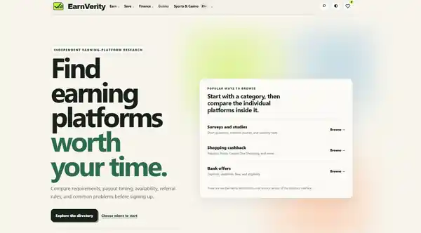
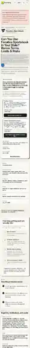
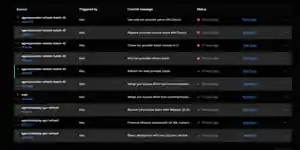

# Screenshots

These are screenshots from the actual EarnVerity development and testing process. The restored copies keep the full frame and original aspect ratio instead of cropping or stretching the screenshots.

## Early homepage layout issue

The search controls and category links were running together in an early version of the homepage. I used this as one of the layout issues to clean up.

## Current homepage

The later homepage uses a simpler layout with clearer navigation, category browsing, and calls to action.

## Mobile platform page testing

I checked long platform pages on a phone-sized layout to make sure detailed information stayed readable and usable on smaller screens. This is the full-page mobile capture, so it is naturally much taller than the desktop screenshots.

## Deployment QA

I also checked Cloudflare deployments after changes and worked through failed builds before treating an update as complete.

