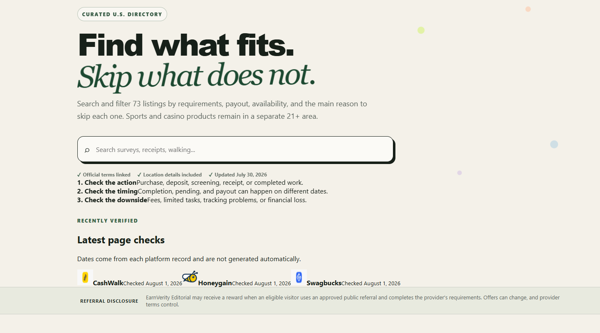
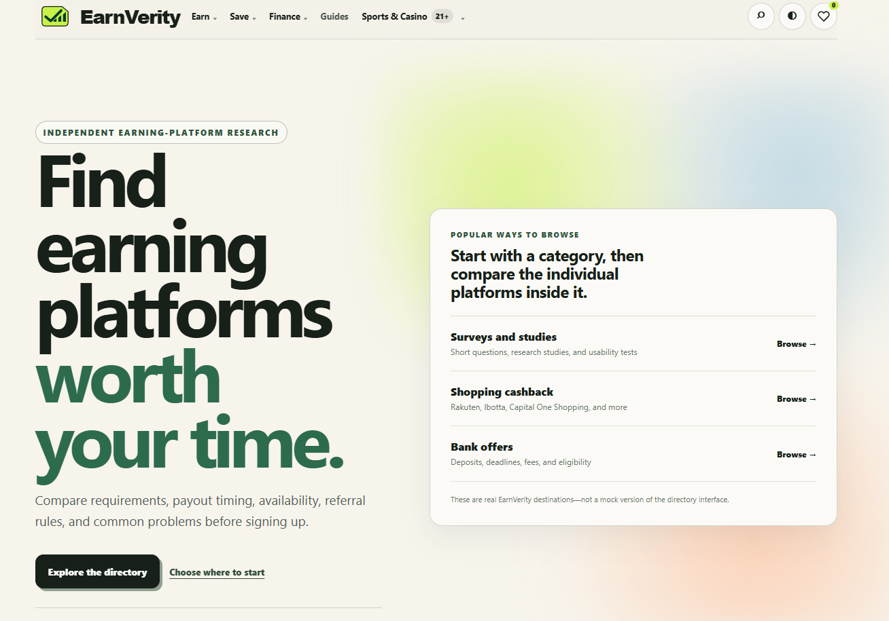

# Screenshots

These are real EarnVerity development screenshots. I am only adding images here when I have a clear original capture instead of a compressed thumbnail.

## Previous homepage

This older homepage was built around the directory itself. The search bar was the main action, the page showed the number of listings near the top, and recent verification checks and referral information appeared directly in the opening section.

## Current homepage

The current homepage is more focused on explaining what EarnVerity does first, then helping users choose where to start. I simplified the opening section, made the navigation clearer, and moved category browsing into a more organized panel instead of putting most of the directory controls into the hero.

### What changed

- moved away from a search-first homepage
- made the purpose of the site clearer before showing directory controls
- simplified the hero and reduced crowded information near the top
- made category browsing easier to scan
- cleaned up navigation and spacing

## Mobile platform page testing

I checked long platform pages on a phone-sized layout to make sure detailed information stayed readable and usable on smaller screens.

Because the mobile screenshot copies I recovered were low quality, I am leaving them out until I have a better original capture.

## Deployment QA

I checked Cloudflare deployments after changes and made sure preview builds and live updates worked before treating changes as finished.

My normal check was:

1. Make the change in GitHub.
2. Wait for the Cloudflare preview build.
3. Check whether the build passed or failed.
4. Open the deployed page and test the change instead of relying only on the build status.
5. If something failed, fix it and deploy again.
6. Treat the change as finished only after the deployed version worked as expected.
